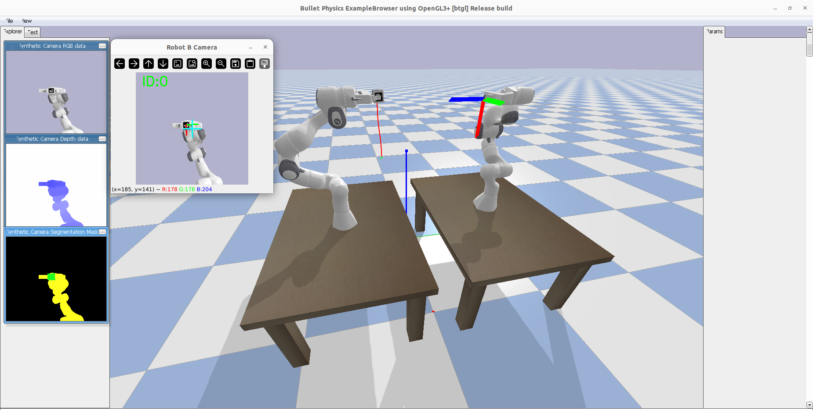

# Dual Panda Pick-and-Track with ArUco Marker

This project simulates a dual Franka Panda robot setup in PyBullet, performing a pick-and-track task with ArUco marker tracking and camera-based feedback.



## Features
- Dual Franka Panda robots in a simulated environment
- Pick-and-place task with trajectory planning (minimum jerk, SLERP, Lissajous)
- Real-time ArUco marker detection using OpenCV
- Camera simulation and visualization
- Modular code structure for easy extension

## Requirements
- Python 3.8+
- PyBullet
- NumPy
- OpenCV (with contrib modules for ArUco)
- Matplotlib

## Installation
1. Clone the repository or copy the project files.
2. (Recommended) Create a virtual environment:
   ```bash
   python3 -m venv pybullet_ws
   source pybullet_ws/bin/activate
   ```
3. Install dependencies:
   ```bash
   pip install pybullet numpy opencv-contrib-python matplotlib
   ```


## Usage

To run the main dual Panda pick-and-place with ArUco tracking demo:
```bash
python launch_dual_panda_pick_aruco_track.py
```


Other launch scripts and their purposes:

**Main directory scripts:**
- `launch_dual_panda_pick_aruco_track.py`: Dual Panda pick-and-place with ArUco tracking, camera feedback, and error plotting.
- `launch_dual_panda_pick_and_place_with_camera.py`: Dual Panda pick-and-place with camera feedback and error plotting (no ArUco tracking).
- `launch_panda_pick_and_place.py`: Basic pick-and-place demo for a single Panda robot.

**Example scripts (in `examples/`):**

### PyBullet Examples
- `example_launch_panda_kinematic_redundancy.py`: Demonstrates kinematic redundancy and null space control for the Panda robot.
- `example_launch_panda_lissajous.py`: Panda robot following a Lissajous trajectory in the XZ plane.
- `example_launch_panda_circle_tracking.py`: Simple Panda robot circular trajectory demo with visualization.
- `example_launch_two_panda.py`: Loads two Panda robots and two tables for basic dual-arm simulation.
- `example_launch_two_panda_with_camera.py`: Two Panda robots with camera simulation and debug visualization.

### ArUco Examples
- `generate_aruco_marker.py`: Generates an ArUco marker image with a white border for use in vision tasks.
- `load_aruco_cube.py`: Loads an ArUco-marked cube into the simulation with correct scaling and texture.

### Other Examples
- `3r_kinematic_redundancy.py`: Demonstrates kinematic redundancy and null space control for a 3R planar robot arm, with visualization.
- `slerp_minimum_jerk_demo.py`: Demo for generating and following a minimum jerk trajectory with SLERP orientation for the Panda robot.
- `estimate_lissajous_params.py`: Moving Horizon Nonlinear Parameter Estimation from noisy data example.

Each script contains a detailed summary at the top describing its functionality.


## Project Structure


- `lib/` : Core library modules (IK, marker detection, robot utilities, etc.)
- `examples/` : Example scripts and demos:
    - `example_launch_panda_kinematic_redundancy.py`: Demonstrates kinematic redundancy and null space control for the Panda robot.
    - `example_launch_panda_lissajous.py`: Panda robot following a Lissajous trajectory in the XZ plane.
    - `example_launch_panda_circle_tracking.py`: Simple Panda robot circular trajectory demo with visualization.
    - `example_launch_two_panda.py`: Loads two Panda robots and two tables for basic dual-arm simulation.
    - `example_launch_two_panda_with_camera.py`: Two Panda robots with camera simulation and debug visualization.
    - `generate_aruco_marker.py`: Generates an ArUco marker image with a white border for use in vision tasks.
    - `load_aruco_cube.py`: Loads an ArUco-marked cube into the simulation with correct scaling and texture.
    - `3r_kinematic_redundancy.py`: Demonstrates kinematic redundancy and null space control for a 3R planar robot arm, with visualization.
    - `slerp_minimum_jerk_demo.py`: Demo for generating and following a minimum jerk trajectory with SLERP orientation for the Panda robot.
- `aruco_cube_description/` : ArUco marker and cube URDF/assets
- `red_cube_description/` : Red cube URDF/assets

## Controls
- The simulation window supports mouse and keyboard interaction.
- Press `Ctrl+C` in the terminal to exit the simulation cleanly.

## Notes
- The ArUco marker detection uses the camera attached to Robot B's end-effector.
- All code is modular and can be extended for new tasks or robots.

## Troubleshooting
- If you encounter missing dependencies, ensure you have installed all required Python packages.
- For OpenCV ArUco support, use `opencv-contrib-python`.

## License
MIT License
